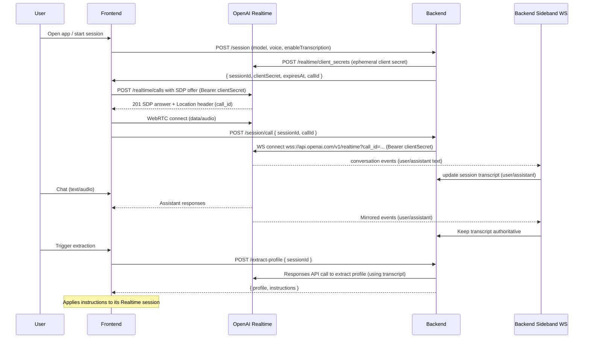
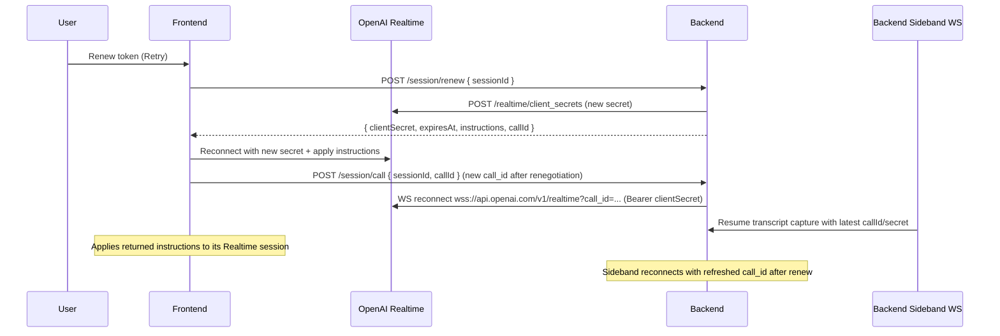
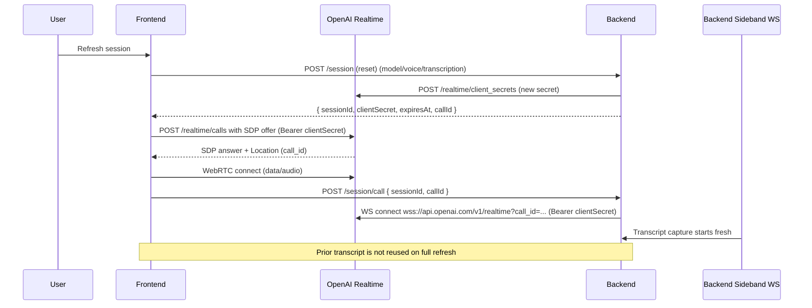

# Realtime Session Flow (with Sideband Transcript Capture)

This diagram shows the end-to-end setup: the frontend creates a session, negotiates WebRTC (getting `call_id`), the backend attaches a sideband WS using that `call_id` and client secret, and the server captures transcript for extraction/rehydration.

Notes:
- The frontend handles the WebRTC SDP exchange and surfaces `call_id` to the backend.
- The backend sideband WS uses the client secret to join the same Realtime session and builds the canonical transcript (user + assistant).
- Extraction and rehydration use the backend transcript; the frontend applies returned instructions after renew.

## Renew Flow (Sideband + Instructions)

This diagram shows how renew rotates the client secret, returns updated instructions + call_id, and reconnects both the frontend and backend sideband to the new session.

## Refresh Session (full reset)

This diagram shows a full refresh: the client requests a brand-new session, negotiates a new call_id, and reattaches the sideband; transcript starts over unless you carry it forward separately.

